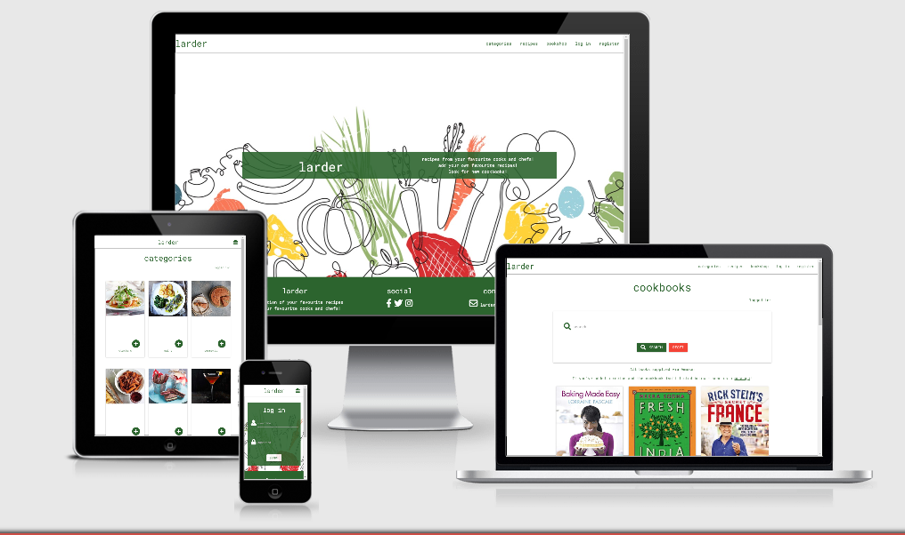

# **CODE INSTITUTE: MILESTONE PROJECT 3** #

# **larder** #

This is the third of four Milestone Projects required for the Full Stack Web Development course provided by Code Institute. The main goal for this project was to produce a "full-stack site that allows the user to manage a common data set about a particular domain" using HTML, CSS, JavaScript, Python+Flask, MongoDB and any other relevant libraries and external API's.

A live version of the site can be found [here](https://milestone-3-larder.herokuapp.com/).

## **CONTENTS** ##

- [UX](#ux)
  - [Project Goals](#project-goals)
  - [User Stories](#user-stories)
  - [Design Process](#design-process)
    - [Fonts](#fonts)
    - [Colours](#colours)
    - [Wireframes](#wireframes)
- [Technology Used](#technology-used)
  - [Languages and Frameworks](#languages-and-frameworks)
  - [API's](#API'S)
  - [Tools](#tools)
- [Features](#features)
- [Testing](#testing)
- [Deployment](#deployment)
  - [Hosting](#hosting)
  - [Cloning](#cloning)
- [Credits](#credits)
  - [Images](#images)
  - [Image editing](#image-editing)
  - [Coding Ideas](#coding-ideas)
- [Acknowledgements](#acknowledgements)

## **UX** ##

### <ins>PROJECT GOALS</ins> ### 

The main aim of this website was to provide a free-to-use recipe resource for the **user** which allows them to add (Create) recipes to the website, search (Read) for recipes on the website, amend (Update) their own recipes and delete (Delete) their own recipes. Their is also the bookshop page which will take the **user** to the appropriate Amazon webpage allowing them to purchase any cookbook that they are interested in.

- To allow the growth of a recipe database for the **user** and by the **user**.
- To allow the **site owner** to encourage the **user** to purchase the cookbooks highlighted on the Bookshop page by directing them to the appropriate Amazon site.

[Back to Contents](#contents)

### <ins>USER STORIES</ins> ###

- As a **user**, I want to be able to register as a new user on the site.
- As a **user**, I want to be able to log on and off the site after I have registered.
- As a **user**, I want to be able to read all the recipes that have been added to the site by the **site owners** and other **users**.
- As a **user**, I want to be able to add my own recipes to the ste to help grow the recipes available and to be part of the "community".
- As a **user**, I want to be able to update any of the recipes that I have added to the site.
- As a **user**, I want to be able to delete any of the recipes that I have added to the site.
- As a **user**, I want to be able to search the site for recipes based key words.
- As a **user**, I want to be able to favourite/like any recipe in the site for easy future reference.
- As a **user**, I want the site navigation to be intuitive and easy to use.
- As a **user**, I want the information to be displayed in a clear and organised manner to allow for quick decisions to be made.
- As a **site owner**, I want the information on the site to be presented in a fun and attractive manner encouraging more **users** to register on the site.
- As a **site owner**, I want to be able to promote cookbook sales.
- As a **site owner**, I want to be able to contact **users** using their profile information with offers.

[Back to Contents](#contents)

### <ins>DESIGN PROCESS</ins> ###

[Back to Contents](#contents)

### <ins>FONTS</ins> ###

### <ins>COLOURS</ins> ###

### <ins>WIREFRAMES</ins> ###

[Back to Contents](#contents)

---  

## **TECHNOLOGY USED** ##

### <ins>LANGUAGES AND FRAMEWORKS</ins> ###

- [HTML](https://developer.mozilla.org/en-US/docs/Web/HTML) - used to create the site structure.
- [CSS](https://developer.mozilla.org/en-US/docs/Web/CSS) - used to create the styling throughout the site.
- [JavaScript](https://developer.mozilla.org/en-US/docs/Web/JavaScript) - this was used for the modal information, the Google Maps markers, the "back to top" button and the registration forms - user and business user.  
- [jQuery](https://jquery.com/) - this was used for the image filtering function.
- [Font-Awesome](https://fontawesome.com/icons?d=gallery) - icons were taken from this site for the footer and social buttons.
- [Bootstrap](https://getbootstrap.com/) - I relied on Bootstrap for the responsive grid design and NavBar.
- [Google fonts](https://fonts.google.com/) - as previously stated, the fonts used were taken from here.
*-789+56123
0.- [Popper](https://900-[popper.js.org/)
- [Popper JS](https://popper.js.org/)
- [Sweet Alert](https://sweetalert.js.org/) - used for the email modal confirming registration success or failure.

### <ins>API'S</ins> ###

- [EmailJS](https://emailjs.com) - this was used to host the email functionality of the site.
  
### <ins>TOOLS</ins> ###

- [Git](https://git-scm.com/) - version control and recording of all changes to site during development process.
- [GitHub](https://github.com/) - used for hosting website.
- [GitPod](https://gitpod.io) - IDE used for code editing. 
- [Figma](https://figma.com/) - wireframing
- [Google Fonts](https://fonts.google.com/) - used to select font families.
- [W3C Validator](https://validator.w3.org/) - used to test my HTML to ensure there were no errors.
- [W3C Validator CSS](https://jigsaw.w3.org/css-validator/) - used to test my CSS to ensure there were no errors.
- [JSHint](https://https://jshint.com/) - used to test my JS to ensure there were no errors.
- [WAVE](https://wave.webaim.org/) - used to test accesibility of site.
- [Free Formatter](https://freeformatter.com/html-formatter.html#ad-output) - html formatter to help keep things tidy!
- [Am I Responsive](http://ami.responsivedesign.is/#) - used to create responsive image for readme.MD.
- [Favicon](https://favicon.io/) - used to generate the Favicon on the webpage tab.
- [Snazzy Maps](https://snazzymaps.com) - used to change the Google Map style.

[Back to Contents](#contents)

---

## **FEATURES** ##

### <ins>FEATURES IMPLEMENTED</ins> ###

### ELEMENTS SEEN ON ALL PAGES ###

### ELEMENTS SEEN ON ... PAGE ###

[Back to Contents](#contents)

---

## **TESTING** ##

Testing information can be found [here](readme/testing.md).

[Back to Contents](#contents)

---

## **DEPLOYMENT** ##

### <ins>HOSTING</ins>

### <ins>CLONING</ins>

[Back to Contents](#contents)

---

## **CREDITS** ##

### <ins>IMAGES AND TEXT CONTENT</ins> ###

The images and card, text content used were sourced from various sites:

### <ins>IMAGE EDITING</ins> ###

### <ins>CODING IDEAS</ins>

[Back to Contents](#contents)

---

## **ACKNOWLEDGEMENTS** ##

Thank you to the following people:

- My mentor Seun Owonikoko for her time, guidance and making things obvious...
- The guys in the class of May 20 on Slack - always there for a chat when needed!
    - special mentions to @nikkikobako, @Sara and @Pauld0051
- My partner, Paul, for putting up with the growing obsession I have towards coding.

[Back to Contents](#contents)

---